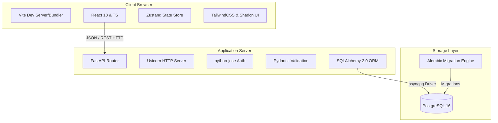

# AI Inventory Management System - Complete System Implementation Guide

This guide provides a granular, end-to-end breakdown of the architecture, database schema, backend services, API design, frontend structures, and deployment configurations of the AI Inventory Management System.

---

## 1. System Architecture & Technology Stack

The application is built as a decoupled single-page application (SPA) frontend communicating with a RESTful backend API.



### 1.1 Frontend Stack
*   **Vite**: The build tool and development server, optimized for fast hot module replacement (HMR) and code splitting.
*   **React 18 & TypeScript**: Single-page application logic with strict type checking.
*   **Zustand**: Lightweight, hook-based state management stores.
*   **TailwindCSS & Shadcn UI**: Tailwind-based premium, responsive component designs utilizing Radix UI primitives.
*   **Lucide React**: Vector icon pack for UI rendering.

### 1.2 Backend Stack
*   **FastAPI**: Asynchronous Python API framework.
*   **Uvicorn**: High-performance ASGI server.
*   **SQLAlchemy 2.0**: Object-Relational Mapper (ORM), fully utilizing the async API.
*   **asyncpg**: Asynchronous PostgreSQL database client driver.
*   **Pydantic v2**: Type validations, setting managers, and request/response model serialization.
*   **python-jose / Passlib**: JWT token encoding/decoding and bcrypt-based password hashing.

---

## 2. Granular Database Schema & SQLAlchemy Models

Database models reside in `backend/app/models/` and extend the `Base` class, inheriting from SQLAlchemy's `DeclarativeBase` alongside a `TimeStampMixin` for tracking `created_at` and `updated_at`.

### 2.1 Access Control & Authentication
*   **`users`**: Contains system user credentials and flags. Columns:
    *   `id`: `Integer` (PK, indexed)
    *   `email`: `String(255)` (Unique, indexed, required)
    *   `username`: `String(120)` (Unique, indexed, required)
    *   `full_name`: `String(255)` (Required)
    *   `hashed_password`: `String(255)` (Required)
    *   `is_active`: `Boolean` (Default: `True`)
    *   `is_superuser`: `Boolean` (Default: `False`)
    *   `phone`: `String(30)` (Optional)
    *   `avatar_url`: `String(255)` (Optional)
*   **`roles`**: System roles. Columns:
    *   `id`: `Integer` (PK)
    *   `name`: `String(50)` (Unique, required)
    *   `description`: `Text`
*   **`permissions`**: Fine-grained permissions. Columns:
    *   `id`: `Integer` (PK)
    *   `name`: `String(100)` (Unique, required, e.g. `product:create`)
    *   `description`: `Text`
    *   `resource`: `String(50)` (e.g. `product`)
    *   `action`: `String(50)` (e.g. `create`)
*   **`user_roles`**: Many-to-Many join table linking `users` and `roles`. Columns:
    *   `user_id`: `Integer` (FK `users.id` on cascade delete, PK)
    *   `role_id`: `Integer` (FK `roles.id` on cascade delete, PK)
*   **`role_permissions`**: Many-to-Many join table linking `roles` and `permissions`. Columns:
    *   `role_id`: `Integer` (FK `roles.id` on cascade delete, PK)
    *   `permission_id`: `Integer` (FK `permissions.id` on cascade delete, PK)
*   **`password_reset_tokens`**: Temporary tokens for password recoveries. Columns:
    *   `id`: `Integer` (PK)
    *   `user_id`: `Integer` (FK `users.id` on cascade delete)
    *   `token_hash`: `String(64)` (Unique, required)
    *   `expires_at`: `DateTime(timezone=True)` (Required)

### 2.2 Products & Suppliers
*   **`categories`**: Hierarchy of item categories. Columns:
    *   `id`: `Integer` (PK, indexed)
    *   `name`: `String(100)` (Unique, indexed, required)
    *   `description`: `Text`
    *   `parent_id`: `Integer` (FK `categories.id` for subcategories)
*   **`products`**: Product specifications and aggregate stock fields. Columns:
    *   `id`: `Integer` (PK, indexed)
    *   `sku`: `String(50)` (Unique, indexed, required)
    *   `name`: `String(255)` (Required)
    *   `description`: `Text`
    *   `category_id`: `Integer` (FK `categories.id`)
    *   `unit`: `String(30)` (Default: `'pcs'`)
    *   `reorder_level`: `Integer` (Default: `10`)
    *   `reorder_quantity`: `Integer` (Default: `20`)
    *   `cost_price`: `Float` (Required)
    *   `selling_price`: `Float` (Required)
    *   `quantity`: `Integer` (Default: `0`)
    *   `stock_status`: `Enum` (Values: `in_stock`, `low_stock`, `out_of_stock`)
    *   `barcode`: `String(100)` (Optional)
    *   `image_url`: `String(255)` (Optional)
*   **`suppliers`**: Vendors for inventory sourcing. Columns:
    *   `id`: `Integer` (PK)
    *   `code`: `String(50)` (Unique)
    *   `name`: `String(255)` (Required)
    *   `email`: `String(255)`
    *   `phone`: `String(30)`
    *   `address_line1`: `String(255)`
    *   `city`: `String(100)`
    *   `country`: `String(100)`
    *   `payment_terms`: `String(50)`
    *   `is_active`: `Boolean` (Default: `True`)

### 2.3 Warehouses & Inventory Allocation
*   **`warehouses`**: Storage facilities. Columns:
    *   `id`: `Integer` (PK, indexed)
    *   `code`: `String(50)` (Unique, indexed)
    *   `name`: `String(255)` (Required)
    *   `address`: `Text`
    *   `city`: `String(100)`
    *   `country`: `String(100)`
    *   `contact_person`: `String(255)`
    *   `is_active`: `Boolean` (Default: `True`)
*   **`product_locations`**: Junction table tracking specific product quantities per warehouse. Columns:
    *   `id`: `Integer` (PK, indexed)
    *   `product_id`: `Integer` (FK `products.id` on cascade delete)
    *   `warehouse_id`: `Integer` (FK `warehouses.id` on cascade delete)
    *   `quantity`: `Integer` (Required)
    *   *Constraint*: Unique on `(product_id, warehouse_id)`.

### 2.4 Purchasing & Sales Transactions
*   **`purchases`**: Sourcing transactions. Columns:
    *   `id`: `Integer` (PK)
    *   `purchase_number`: `String(50)` (Unique, indexed)
    *   `supplier_id`: `Integer` (FK `suppliers.id`)
    *   `warehouse_id`: `Integer` (FK `warehouses.id`)
    *   `status`: `Enum` (Values: `DRAFT`, `SENT`, `PARTIALLY_RECEIVED`, `RECEIVED`, `CANCELLED`)
    *   `total_amount`: `Float`
    *   `notes`: `Text`
*   **`purchase_items`**: Line items inside a purchase order. Columns:
    *   `id`: `Integer` (PK)
    *   `purchase_id`: `Integer` (FK `purchases.id` on cascade delete)
    *   `product_id`: `Integer` (FK `products.id`)
    *   `quantity`: `Integer` (Required)
    *   `received_quantity`: `Integer` (Default: `0`)
    *   `unit_price`: `Float` (Required)
    *   `total_price`: `Float` (Required)
    *   `batch_number`: `String(100)`
    *   `expiry_date`: `Date`
    *   `manufacture_date`: `Date`
*   **`sales`**: Outbound customer orders. Columns:
    *   `id`: `Integer` (PK)
    *   `invoice_number`: `String(50)` (Unique, indexed)
    *   `warehouse_id`: `Integer` (FK `warehouses.id`)
    *   `status`: `Enum` (Values: `DRAFT`, `CONFIRMED`, `CANCELLED`, `REFUNDED`)
    *   `customer_name`: `String(255)`
    *   `notes`: `Text`
*   **`sale_items`**: Line items in a sales invoice. Columns:
    *   `id`: `Integer` (PK)
    *   `sale_id`: `Integer` (FK `sales.id` on cascade delete)
    *   `product_id`: `Integer` (FK `products.id`)
    *   `quantity`: `Integer` (Required)
    *   `unit_price`: `Float` (Required)
    *   `discount_percent`: `Float` (Default: `0.0`)
    *   `total_price`: `Float` (Required)

### 2.5 Audit, Ledgers, & Forecasts
*   **`stock_ledger`**: Immutable audit logs of all inventory movements. Columns:
    *   `id`: `Integer` (PK, indexed)
    *   `product_id`: `Integer` (FK `products.id`)
    *   `warehouse_id`: `Integer` (FK `warehouses.id`)
    *   `type`: `Enum` (Values: `IN`, `OUT`, `ADJUSTMENT`, `TRANSFER_IN`, `TRANSFER_OUT`)
    *   `qty_change`: `Integer` (Required)
    *   `qty_before`: `Integer` (Required)
    *   `qty_after`: `Integer` (Required)
    *   `reference_type`: `String(50)` (e.g. `"purchase"`, `"sale"`, `"adjustment"`)
    *   `reference_id`: `Integer`
    *   `note`: `Text`
    *   `created_by`: `Integer` (FK `users.id`)
*   **`stock_adjustments`**: Records of manual stock takes/overrides. Columns:
    *   `id`: `Integer` (PK, indexed)
    *   `product_id`: `Integer` (FK `products.id`)
    *   `warehouse_id`: `Integer` (FK `warehouses.id`)
    *   `adjustment_type`: `String(8)` (Values: `INCREASE`, `DECREASE`)
    *   `quantity`: `Integer` (Required)
    *   `reason`: `String(255)` (Required)
    *   `note`: `Text`
    *   `adjustment_reference`: `String(100)` (Unique)
    *   `created_by`: `Integer` (FK `users.id`)
*   **`audit_logs`**: Security logs mapping ORM data mutations. Columns:
    *   `id`: `Integer` (PK)
    *   `user_id`: `Integer` (FK `users.id`)
    *   `action`: `String(30)` (Required)
    *   `table_name`: `String(80)`
    *   `record_id`: `Integer`
    *   `old_data`: `JSONB`
    *   `new_data`: `JSONB`
    *   `ip_address`: `INET`
    *   `user_agent`: `Text`
*   **`notifications`**: User warning alerts. Columns:
    *   `id`: `Integer` (PK)
    *   `user_id`: `Integer` (FK `users.id` on cascade delete)
    *   `title`: `String(200)`
    *   `message`: `Text`
    *   `type`: `String(20)` (Default: `'info'`)
    *   `is_read`: `Boolean` (Default: `False`)
    *   `read_at`: `DateTime`
    *   `source_type`: `String(50)`
    *   `source_id`: `String(100)`
    *   `source_key`: `String(160)`
    *   *Constraint*: Unique on `(user_id, source_key)`.
*   **`demand_forecasts`**: Storage for forecasting records. Columns:
    *   `id`: `Integer` (PK)
    *   `product_id`: `Integer` (FK `products.id` on cascade delete)
    *   `warehouse_id`: `Integer` (FK `warehouses.id` on cascade delete)
    *   `horizon_days`: `Integer` (7, 14, 30, 60, 90)
    *   `predicted_qty`: `Float`
    *   `model_name`: `String(80)`
    *   `metrics`: `JSONB`

---

## 3. Backend Implementation & Design Patterns

The backend architecture uses specific code design patterns to achieve clean separations of concern, scalability, and type safety.

### 3.1 Asynchronous Database Session Injection (`get_db`)
The database connection lifecycle is controlled in `backend/app/core/database.py` using SQLAlchemy async sessions.
*   **Engine Definition**:
    ```python
    engine = create_async_engine(str(settings.DATABASE_URI), echo=settings.DEBUG, future=True, pool_pre_ping=True)
    AsyncSessionLocal = async_sessionmaker(engine, class_=AsyncSession, expire_on_commit=False, autocommit=False, autoflush=False)
    ```
*   **Dependency Yield**:
    ```python
    async def get_db() -> AsyncGenerator[AsyncSession, None]:
        async with AsyncSessionLocal() as session:
            try:
                yield session
                await session.commit()
            except Exception:
                await session.rollback()
                raise
            finally:
                await session.close()
    ```
    Endpoints declare `db: AsyncSession = Depends(get_db)`. If an endpoint execution completes without errors, transaction commits automatically. If an exception raises, the yield block rolls back changes to preserve state integrity.

### 3.2 Generic Base Service Abstraction
All service classes extend a common `BaseService` defined in `backend/app/services/base_service.py`. It utilizes Python Generics for type checks:
```python
ModelType = TypeVar("ModelType", bound=Base)
CreateSchemaType = TypeVar("CreateSchemaType", bound=BaseModel)
UpdateSchemaType = TypeVar("UpdateSchemaType", bound=BaseModel)

class BaseService(Generic[ModelType, CreateSchemaType, UpdateSchemaType]):
    def __init__(self, model: Type[ModelType], db: AsyncSession):
        self.model = model
        self.db = db

    async def get(self, id: Any) -> Optional[ModelType]:
        result = await self.db.execute(select(self.model).where(self.model.id == id))
        return result.scalar_one_or_none()
```
This encapsulates standard querying routines (such as selecting lists, counting items, mapping schemas, and performing deletions) to eliminate code replication across model routers.

### 3.3 Security & Role Checking Engine (`RequirePermission`)
Authentication and RBAC validation logic is encapsulated in `backend/app/core/security.py`.
*   **JWT Decoding**: Extracts user identifier and claims from standard authorization headers.
*   **Permission Guards**:
    ```python
    class RequirePermission:
        def __init__(self, permission_name: str):
            self.permission_name = permission_name

        async def __call__(self, current_user: User = Depends(get_current_active_user), db: AsyncSession = Depends(get_db)) -> User:
            # Bypass permission verification if user is superuser
            if current_user.is_superuser:
                return current_user
                
            # Intersect permissions mapped via role relationships
            user_has_perm = False
            for role in current_user.roles:
                for perm in role.permissions:
                    if perm.name == self.permission_name:
                        user_has_perm = True
                        break
            if not user_has_perm:
                raise HTTPException(status_code=status.HTTP_403_FORBIDDEN, detail="Permission Denied")
            return current_user
    ```
    This is declared as a dependency in FastAPI routers to protect endpoints:
    `@router.post("/", dependencies=[Depends(RequirePermission("product:create"))])`

### 3.4 Asynchronous Stock Balance Sync Pipeline
To guarantee database consistency when altering product counts, all operations are managed under SQLAlchemy transaction contexts.
1.  **State Lookup**: Lookup specific quantity checks via `product_locations`.
2.  **Ledger Log**: Post stock adjustments or sales transactions.
3.  **Atomic Sync**:
    *   Updates the specific location quantity.
    *   Recalculates the total global quantity of the product by querying the sum of all location allocations.
    *   Saves the aggregate quantity inside the `products` table and updates `products.stock_status` dynamically based on the target `reorder_level`.

---

## 4. Alembic & PostgreSQL Configuration

During the migration from SQLite to PostgreSQL, the Alembic database migration client was set up to work with async engines and Pydantic configuration loaders.

### 4.1 Dynamic settings loading (`alembic/env.py` and `alembic.ini`)
*   **Zero Credential Hardcoding**: `alembic.ini` contains no database passwords. Instead, it is configured with:
    `sqlalchemy.url = postgresql+asyncpg://placeholder`
*   **Runtime Setup**: At execution time, `env.py` reads database credentials directly from Pydantic settings: `settings.DATABASE_URI` (loaded automatically from backend `.env`).
*   **Percent-Escaping**:
    ```python
    from app.core.config import settings
    # Escape percent characters to prevent ConfigParser from trying to interpolate password percentages
    config.set_main_option("sqlalchemy.url", str(settings.DATABASE_URI).replace("%", "%%"))
    ```

### 4.2 Asynchronous Runner in Alembic
Alembic migrations run on an async dialect (`asyncpg`) by calling `asyncio.run()` in `run_migrations_online()`:
```python
async def run_async_migrations() -> None:
    connectable = create_async_engine(str(settings.DATABASE_URI), poolclass=pool.NullPool)
    async with connectable.connect() as connection:
        await connection.run_sync(do_run_migrations)
```

### 4.3 Query Parameter Type Interception
To allow old migrations containing untyped query parameters (like `SELECT :name, :description WHERE NOT EXISTS (...)`) to execute cleanly on `asyncpg` without throwing `AmbiguousParameterError` exceptions, a SQLAlchemy event listener was registered inside `env.py`:
```python
from sqlalchemy import event
from sqlalchemy.engine import Engine
import re

@event.listens_for(Engine, "before_cursor_execute", retval=True)
def receive_before_cursor_execute(conn, cursor, statement, parameters, context, executemany):
    if "INSERT INTO permissions" in statement:
        statement = re.sub(
            r"SELECT\s+\$1,\s+\$2,\s+\$3,\s+\$4",
            "SELECT $1::varchar, $2::varchar, $3::varchar, $4::varchar",
            statement
        )
    return statement, parameters
```
This intercepts compiled database queries and injects type-casts (`::varchar`) to satisfy PostgreSQL's strict parameter type checks, leaving historical migration files unaltered.

---

## 5. Frontend Architecture & Features

The frontend SPA structure is highly modularized around "features" (`frontend/src/features/`).

### 5.1 Zustand Stores
*   **`useAuthStore`**: Handles JWT state:
    *   Tracks authenticated state, access token, and refresh token.
    *   Parses user claims, permissions, and role lists.
    *   Utilizes a silent background token-refresh mechanism when API requests encounter `401 Unauthorized` responses.
*   **`usePurchaseStore`** & **`useSaleStore`**: Manages temporary inputs, validation states, and wizard steps during PO and Sales Invoice creation flows.

### 5.2 Navigation Routing & Guards
Defined in `frontend/src/app/router.tsx`:
*   **`RequireGuest`**: Limits access to `/auth/login`, `/auth/forgot-password`, and `/auth/reset-password` routes to unauthenticated visitors.
*   **`RequireAuth`**: Blocks unauthenticated visitors from accessing dashboards and redirects them to the login screen.
*   **`RequirePermission`**: Restricts sensitive views using Role-Based Access Control (RBAC):
    *   `/warehouses` $\rightarrow$ requires `permissions.warehouse_view`
    *   `/customers` $\rightarrow$ requires `permissions.customer_view`
    *   `/stock-adjustments` $\rightarrow$ requires `permissions.stock_adjustment_view`
    *   `/reports` $\rightarrow$ requires `permissions.reports_view`
    *   `/ai/forecast` $\rightarrow$ requires `permissions.ai_forecast_view`
    *   `/ai/reorder` $\rightarrow$ requires `permissions.ai_reorder_view`
    *   `/audit-logs` $\rightarrow$ requires `permissions.admin_audit_view`
    *   `/users` $\rightarrow$ requires `permissions.admin_users_manage`

### 5.3 Feature Pages Implementation
*   **Dashboard Page (`/dashboard`)**:
    *   Displays stats cards (Total Products, Active Orders, Revenue, alerts).
    *   Lists recent stock movements, low-stock warnings, and warehouse allocations.
*   **AI Forecasting Page (`/ai/forecast`)**:
    *   Loads predicted demand data from `/api/v1/forecast/`.
    *   Renders charts showing moving-average demand planning, seasonal predictions, and inventory risk scores.
*   **Reports Engine Page (`/reports`)**:
    *   Contains distinct tabs (Inventory Valuations, Purchases audits, Sales metrics, Stock Movements ledger).
    *   Allows managers to specify parameter ranges (warehouses, dates, item categories) and triggers downloads of Excel sheets or PDF files.
*   **Transaction Wizards (`/purchases/new`, `/sales/new`)**:
    *   Multi-step form guides for creating purchase or sales orders.
    *   Calculates pricing, tax, and discount percentages dynamically.
    *   Validates item SKUs and warehouse stock quantities in real time.
*   **Stock Ledger & Adjustments (`/stock-ledger`, `/stock-adjustments`)**:
    *   The **Stock Ledger** page presents a filterable log of all stock movements.
    *   The **Stock Adjustments** page provides forms for inventory managers to post manual overrides (e.g. after a physical count), updating inventory levels and logging the adjustment context.
*   **Audit Logs Page (`/audit-logs`)**:
    *   Renders list of security events, showing the user, action, target database table, and JSON diffs of database records before and after changes.
*   **Users Page (`/users`)**:
    *   Provides user management interfaces, allowing admins to create accounts, reset passwords, lock/unlock accounts, and map roles.
*   **Settings Page (`/settings`)**:
    *   Allows configuration of email SMTP servers, AI forecasting intervals, and system parameters.
