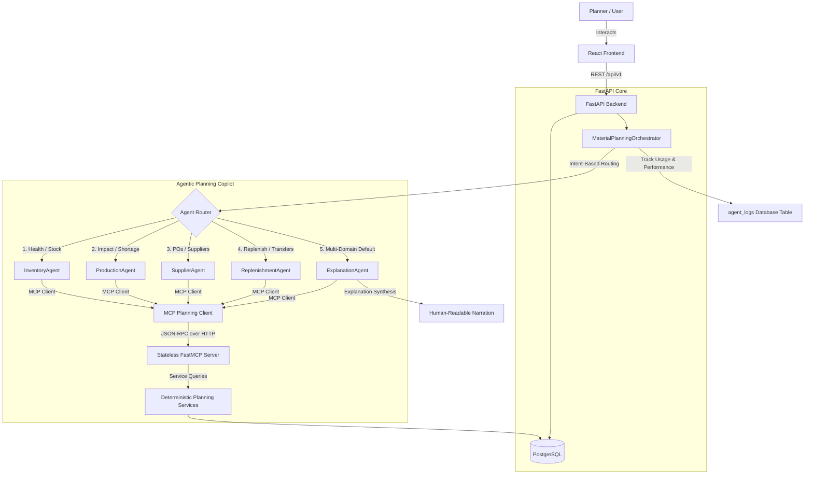

# AI Inventory Management & Manufacturing Planning System

A state-of-the-art, full-stack inventory operations and manufacturing demand planning platform. This system integrates role-based operations with an **agentic AI Material Planning Copilot** that automates inventory alerts, risk assessments, replenishment suggestions, and production impact checks.

Built with **React + TypeScript** on the frontend and **FastAPI + PostgreSQL + Microsoft Agent Framework** on the backend.

---

## 🚀 Architectural Blueprint

The application is structured into three primary layers: the responsive user interface, the API backend, and the state-of-the-art **Material Planning Copilot** executing over a streamable-http MCP boundary.



---

## 🤖 Material Planning Copilot Features

The Material Planning Copilot consists of a collaborative team of specialist agents designed under the **Microsoft Agent Framework**:

*   **InventoryAgent**: Explains safety stock levels, buffer sizes, usable stock status, and cross-plant inventory availability.
*   **ProductionAgent**: Analyzes the Bill of Materials (BOM), detects projected shortages, and determines which production orders will be delayed due to missing components.
*   **SupplierAgent**: Audits purchase order schedules, identifies late or partial shipments, and scores supplier reliability based on lead time variance.
*   **ReplenishmentAgent**: Automatically applies a 4-rule deterministic replenishment engine (PO expediting, inter-plant stock transfer, new purchase orders, safety stock restoration).
*   **ExplanationAgent**: Synthesizes the evidence gathered by the specialist agents into professional, concise, planner-grounded action summaries.

### Technical Implementation Details:
*   **Stateless FastMCP Integration**: The background MCP server (`FastMCP`) runs on port `8001` in stateless ASGI mode. Each agent execution creates a lightweight client connection that executes tools concurrently without session collision or ID locking.
*   **Responses API**: Integrates natively with Azure OpenAI's Responses API (`2025-03-01-preview` or later) to execute tools and generate responses.
*   **Persistent Performance Audits**: Every query request is timed, tokens are extracted from LLM usage details, and the results are saved to the `agent_logs` SQL table for billing and auditing transparency.
*   **Rate-Limit (429) & Token Optimizations**:
    *   **Payload Filtering**: Core MCP tools (`get_inventory_health`, `get_material_risk`, `recommend_replenishment`) accept optional `material_code` and `plant_name` filters. The specialist agents intelligently supply these filters based on user prompts, shrinking prompt size by over **95%** and avoiding Rate Limits.
    *   **Auto-Retry**: The Async client uses native exponential backoff with a maximum of `5` retries to gracefully handle temporary rate limiting.

---

## 🛠️ Core Application Features

### 1. Inventory & Warehouse Operations
*   **Product Catalog**: Hierarchical product categories with custom attributes (cost price, selling price, unit, planner, procurement type).
*   **Stock Ledger**: Every single movement (purchase receipt, sales delivery, adjustments) writes an immutable transaction ledger entry, enforcing strict auditable traceability.
*   **Warehouse Routing**: Manage inventory levels across multiple warehouses and plants (`Plant A`, `Plant B`, etc.).

### 2. Purchase & Sales Lifecycle
*   **Purchase Orders**: Workflow from Draft -> Sent -> Partially Received -> Fully Received. Automatically updates stock ledger and updates material availability projections.
*   **Sales Orders**: Create sales demands that decrement stock ledger balances upon completion.

### 3. Analytics & Demand Forecasting
*   **Low Stock Alerts**: Automatically flagged thresholds based on safety stock configuration.
*   **Demand Forecasting**: Rolling moving-average consumption forecast.
*   **Slow-Moving Stock**: Detection of static inventory eating up holding costs.

---

## 📂 Project Structure

```text
.
├── backend/
│   ├── app/
│   │   ├── api/v1/endpoints/   # FastAPI REST routes (including /planning/copilot)
│   │   ├── core/               # Configuration, Database Setup, LLM Factory
│   │   ├── models/             # SQLAlchemy ORM models (Inventory, MaterialRisk, etc.)
│   │   ├── schemas/            # Pydantic validation schemas
│   │   ├── services/           # Deterministic planning, risk, and PO analysis engines
│   │   ├── mcp/
│   │   │   ├── server.py       # FastMCP Server exposing planning tools
│   │   │   └── client.py       # MCP client interface for specialist agents
│   │   └── agents/
│   │       ├── base_agent.py   # Base class wrapping Microsoft Agent Framework
│   │       ├── orchestrator.py # Intent router, synthesis manager, audit logger
│   │       └── *_agent.py      # Individual specialist agents
│   └── tests/                  # Pytest unit testing suite
├── frontend/
│   ├── src/
│   │   ├── features/           # Feature-based pages (Inventory, Purchases, Copilot UI)
│   │   ├── services/           # Backend REST client connections
│   │   └── stores/             # Zustand stores for state management
│   └── package.json
└── database/
    └── schema.sql              # Clean DDL database schema bootstrap
```

---

## ⚙️ Local Development Setup

### Prerequisites
*   Node.js 20+
*   Python 3.11+
*   PostgreSQL 14+

### 1) Configuration (.env)
Copy `backend/.env.example` to `backend/.env` and update the database and Azure OpenAI credentials:
```ini
# Database Connection
POSTGRES_USER=postgres
POSTGRES_PASSWORD=your_password
POSTGRES_SERVER=localhost
POSTGRES_PORT=5432
POSTGRES_DB=ai_inventory_db

# Azure OpenAI Credentials (Required for Planning Copilot)
AZURE_OPENAI_ENDPOINT=https://<your-resource>.openai.azure.com/
AZURE_OPENAI_API_KEY=<your-key>
AZURE_OPENAI_DEPLOYMENT=gpt-4.1
AZURE_OPENAI_API_VERSION=2025-03-01-preview

# MCP Server Settings
MCP_SERVER_HOST=127.0.0.1
MCP_SERVER_PORT=8001
MCP_SERVER_URL=http://127.0.0.1:8001/mcp
```

### 2) Backend Setup
Navigate to the `backend/` directory, set up your virtual environment, and install dependencies:
```bash
cd backend
python -m venv .venv
source .venv/bin/activate   # On Windows: .venv\Scripts\activate
pip install -r requirements.txt
```

Run the FastAPI application (which automatically launches the stateless FastMCP background server on port `8001`):
```bash
uvicorn app.main:app --reload --port 8000
```
*   **Swagger API Docs**: http://localhost:8000/api/v1/docs
*   **MCP Streamable Endpoint**: http://localhost:8001/mcp

### 3) Frontend Setup
Navigate to the `frontend/` directory, install packages, and boot up Vite:
```bash
cd ../frontend
npm install
npm run dev
```
*   **Vite Development Server**: http://localhost:5173

**Default Admin Credentials:**
*   **Username**: `admin`
*   **Password**: `admin123`

---

## 🧪 Testing and Verification

### Backend Unit Tests
Execute the unit tests using `pytest` inside the active virtual environment:
```bash
cd backend
.venv\Scripts\pytest
```

### Automated Copilot Verification Scenario Run
To run the automated agentic scenarios sequentially and test DB, MCP, and AI integration:
```bash
.venv\Scripts\python backend/scripts/verify_planning_copilot.py
```

---

## 📸 Interface Preview

### Dashboard Analytics


### Products Catalog Management


### Purchasing Workflow Lifecycle


### Sales Demands Lifecycle


### Alerts & AI Copilot Workspace


---

## 👥 Authors & Contributions

*   👤 **Lakshitha Dilshan**
*   📧 lakshithadilshan.info@gmail.com
*   🔗 LinkedIn: https://www.linkedin.com/in/jkplakshithadilshan/
*   🌐 Portfolio: https://www.lakshithadilshan.me

⭐ If you find this agentic operations platform helpful, consider giving the repository a star!
