# MARA Database Schema Specification

This document provides a detailed overview of the PostgreSQL database schema for the **Material Availability & Inventory Replenishment Agent (MARA)**. 

---

## Entity-Relationship (ER) Diagram

```mermaid
erDiagram
    categories ||--o{ materials : "groups"
    plants ||--o{ plant_inventory : "hosts"
    materials ||--o{ plant_inventory : "stored_in"
    materials ||--o{ bom_headers : "defines_bom"
    bom_headers ||--o{ bom_items : "contains"
    materials ||--o{ bom_items : "used_as_component"
    plants ||--o{ production_orders : "executed_at"
    materials ||--o{ production_orders : "produces"
    suppliers ||--o{ purchase_orders : "supplies"
    plants ||--o{ purchase_orders : "receives_at"
    purchase_orders ||--o{ purchase_items : "contains"
    materials ||--o{ purchase_items : "orders"
    suppliers ||--o{ supplier_performance : "evaluated_on"
    materials ||--o{ replenishment_recommendations : "suggests_for"
    plants ||--o{ replenishment_recommendations : "recommends_to"
    materials ||--o{ material_risks : "risk_calculated_for"
    plants ||--o{ material_risks : "risk_measured_at"
    materials ||--o{ material_projections : "projects"
    plants ||--o{ material_projections : "projected_at"
    users ||--o{ user_roles : "assigned_to"
    roles ||--o{ user_roles : "granted_to"
    roles ||--o{ role_permissions : "allowed_to"
    permissions ||--o{ role_permissions : "enforced_on"

    categories {
        int id PK
        string name
        string description
        int parent_id FK
    }

    plants {
        int id PK
        string code "PLT-XXX"
        string name
        string address
        string city
        string state
        string country
        string postal_code
        string contact_person
        string phone
        string email
        boolean is_active
    }

    materials {
        int id PK
        string material_code "MAT-XXXXX"
        string name
        string description
        int category_id FK
        string material_type "RAW, COMPONENT, ASSEMBLY, FINISHED"
        string unit
        string planner
        string procurement_type "MAKE, BUY"
        int lead_time
        string abc_classification "A, B, C"
        string criticality "HIGH, MEDIUM, LOW"
        float cost_price
        float selling_price
        boolean is_active
    }

    plant_inventory {
        int id PK
        int material_id FK
        int plant_id FK
        int on_hand
        int reserved
        int blocked
        int quality_hold
        int in_transit
        int safety_stock
        int buffer_stock
        int reorder_point
        int usable_inventory "Calculated field"
    }

    bom_headers {
        int id PK
        int material_id FK "Assembly SKU"
        string name
        string version
        boolean is_active
    }

    bom_items {
        int id PK
        int bom_id FK
        int component_id FK "Component SKU"
        float quantity
    }

    production_orders {
        int id PK
        string order_number "PROD-XXXXX"
        int material_id FK "Assembly SKU"
        int plant_id FK
        int quantity
        date start_date
        date required_date
        string status "PLANNED, IN_PROGRESS, COMPLETED, CANCELLED"
        string priority "CRITICAL, HIGH, MEDIUM, LOW"
    }

    suppliers {
        int id PK
        string code "SUP-XXXX"
        string name
        string contact_person
        string email
        string phone
        string address_line1
        string city
        string country
        string payment_terms
        boolean is_active
    }

    purchase_orders {
        int id PK
        string po_number "PO-XXXXX"
        int supplier_id FK
        int plant_id FK
        date order_date
        date expected_receipt_date
        float total_amount
        string status "DRAFT, SENT, PARTIALLY_RECEIVED, RECEIVED, CANCELLED"
    }

    purchase_items {
        int id PK
        int purchase_order_id FK
        int material_id FK
        int quantity
        int received_quantity
        float unit_price
    }

    supplier_performance {
        int id PK
        int supplier_id FK
        date evaluation_date
        float on_time_delivery_rate
        float quality_rating "0-100"
        float lead_time_variance "in days"
        int total_orders
        int late_orders
    }

    replenishment_recommendations {
        int id PK
        int material_id FK
        int plant_id FK
        string recommendation_type "Expedite PO, Transfer, Replenish"
        float quantity
        date order_date
        date eta_date
        int source_plant_id FK "Optional"
        string reason
        string evidence
        float confidence
        string priority "CRITICAL, HIGH, MEDIUM, LOW"
        string status "NEW, APPROVED, REJECTED"
    }

    material_risks {
        int id PK
        int material_id FK
        int plant_id FK
        float risk_score "0-100"
        float urgency
        float material_criticality
        float production_impact
        float supplier_delay
        float safety_stock_violation
        float late_po
        string reason
        date first_shortage_date
        float shortage_quantity
        date recovery_date
        int days_of_coverage
    }

    material_projections {
        int id PK
        int material_id FK
        int plant_id FK
        date date
        int incoming_supply
        int production_demand
        int projected_balance
        boolean is_shortage
    }
```

---

## Database Tables & Schema Reference

### 1. Materials Specification (`materials` & `categories`)
* **`categories`**: Groupings of components/assemblies. Supports recursive subcategory trees through `parent_id`.
* **`materials`**: Catalog of items, including classification codes, planner assignments, lead times, costing, and manufacturing properties.

| Field | Type | Constraints | Description |
|---|---|---|---|
| `id` | Integer | Primary Key | Auto-incrementing identifier |
| `material_code` | VARCHAR(50) | Unique, Index, Not Null | Material identifier (e.g. `MAT-10001`) |
| `name` | VARCHAR(255) | Index, Not Null | Material Name |
| `material_type` | VARCHAR(50) | Default: `'RAW'` | `RAW`, `COMPONENT`, `ASSEMBLY`, `FINISHED` |
| `procurement_type`| Enum | MAKE / BUY | Sourcing type |
| `abc_classification` | Enum | A / B / C | ABC inventory classification |
| `criticality` | Enum | HIGH / MEDIUM / LOW | Criticality ranking for risk engine |
| `lead_time` | Integer | Default: `7` | Sourcing/assembly lead time in days |

### 2. Plant Inventory Stock & Policy (`plant_inventory` & `plants`)
* **`plants`**: Sourcing/production sites representing manufacturing plants.
* **`plant_inventory`**: Tracks real-time counts and security buffer settings for each material at a specific plant.

| Field | Type | Default | Description |
|---|---|---|---|
| `on_hand` | Integer | `0` | Physical stock present at the plant |
| `reserved` | Integer | `0` | Stock allocated to scheduled production/sales |
| `blocked` | Integer | `0` | Restricted stock (cannot be used/moved) |
| `quality_hold` | Integer | `0` | Stock pending quality control check |
| `usable_inventory` | Integer | `0` | Calculated field: `on_hand - reserved - blocked - quality_hold` |
| `safety_stock` | Integer | `0` | Minimum policy safety buffer |
| `buffer_stock` | Integer | `0` | Minimum safety buffer warning threshold |
| `reorder_point` | Integer | `0` | Policy threshold value that triggers purchase order suggestion |

### 3. Production Planning (`production_orders`, `bill_of_materials`, `bom_items`)
* **`production_orders`**: Scheduled assembly schedules representing manufacturing demand. Consumes components from inventory.
* **`bill_of_materials`**: The assembly relationship recipe header.
* **`bom_items`**: The quantities of components/raw metals required to create a unit of assembly.

### 4. Sourcing & SCM (`suppliers`, `purchase_orders`, `purchase_order_items`, `supplier_performance`)
* **`suppliers`**: Sourcing vendors.
* **`purchase_orders` & `purchase_order_items`**: Supply orders submitted to suppliers.
* **`supplier_performance`**: Tracks historic performance metrics (lead-time variance, on-time delivery rates) used by the Risk Engine to compute supply risk.

### 5. Agent Decision Support (`replenishment_recommendations`, `material_risks`, `material_projections`)
* **`material_projections`**: Time-phased projected balances computed day-by-day.
* **`material_risks`**: Pre-calculated stockout risk evaluations.
* **`replenishment_recommendations`**: Replenishment orders or plant transfers generated by the Agent rule engine.

---

## Role-Based Access Control (RBAC) Schema

| Table Name | Description |
|---|---|
| **`users`** | Application user accounts (username, hashed password, is_superuser flag). |
| **`roles`** | Assigned user roles (e.g. `ADMIN`, `MANAGER`, `STAFF`, `HR`, `VIEWER`). |
| **`permissions`** | Specific application scopes (e.g. `ai:forecast:view`, `products:read`, `purchase:write`). |
| **`user_roles`** | Link table mapping users to roles. |
| **`role_permissions`** | Link table mapping roles to specific permissions. |
